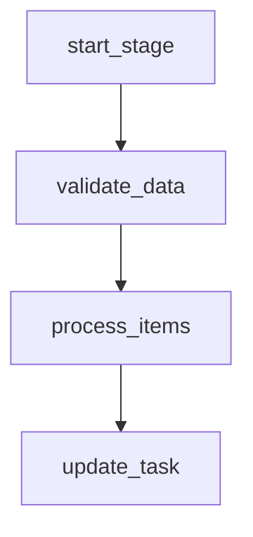
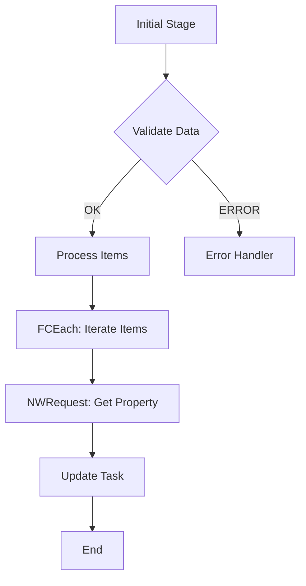
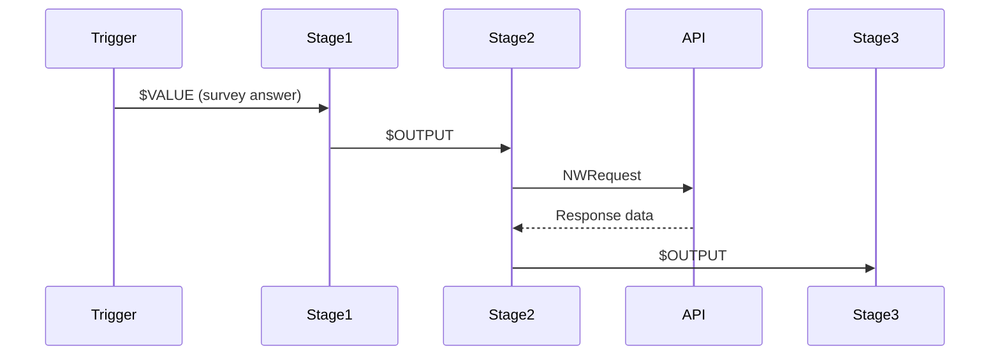

# CLAUDE.md

This file provides guidance to Claude Code when working with this repository.

## Project Overview

**Cotalker Routine Optimizer** is an intelligent assistant designed to work WITH Claude Code for analyzing and optimizing Cotalker bot routines.

This is NOT a standalone CLI tool with rigid analyzers. Instead, it's a **knowledge-driven system** where Claude Code uses parser utilities, knowledge base, and validators to interactively optimize routines.

### Real-world problems solved
- AWS Lambda `RequestEntityTooLargeException` (413 errors) from >6MB payloads
- Timeouts from N+1 query patterns (FCEach loops with NWRequest stages)
- Scalability issues under data growth
- Missing error handling in critical workflows

## How to Use This Project

### User workflow (SIMPLIFIED)

1. **User exports routine** from MongoDB (specific to their Cotalker company)
2. **User places routine** in `routines/input/current.json`
3. **User talks to you directly**: "Revisa @routines/input/current.json y optimízala"
4. **You analyze and optimize** interactively

**NO CLI required** - User works with you directly in the project.

### Your role as Claude Code

When the user asks you to review/optimize a routine:

1. **Read the routine** from `routines/input/current.json`
2. **Load knowledge base** from `knowledge/` (all 7 files)
3. **Create new session** using `src/utils/session-manager.js`
4. **Analyze interactively**:
   - Detect anti-patterns (knowledge-driven, not hardcoded analyzers)
   - Validate endpoints with `curl` if uncertain
   - Verify referenced routines exist via API if needed
   - Validate COTLang syntax
   - Propose optimizations using `templates/`
5. **Generate optimized routine** and save to session directory
6. **Save all artifacts** to `.sessions/TIMESTAMP/`:
   - `input.json` - Copy of original
   - `optimized.json` - Optimized version
   - `analysis.md` - Detailed analysis
   - `changes.diff` - Visual diff
   - Any other files generated during optimization

When the user asks you to **create a new routine** from business requirements:

1. **Collect the business requirement** in Spanish
2. **Load creation knowledge** from `knowledge/routine-creation-guide.md`
3. **Load knowledge base** (`cotalker-routines.md`, `cotlang-reference.md`, `best-practices.md`, `cotalker-api-reference.md`)
4. **Phase 1 - Design**: Generate Mermaid diagram + stage table + data flow → **WAIT for user approval**
5. **Phase 2 - Generate**: Create `routine.json` (complete MongoDB document) + `setup-guide.md` with all best practices applied
6. **Save all artifacts** to `.sessions/TIMESTAMP/`:
   - `requirement.md` - Original business requirement
   - `design.md` - Approved design (Mermaid + stages + data flow)
   - `routine.json` - Complete routine ready to import
   - `setup-guide.md` - Import and configuration instructions

## Project Structure

```
cotalker-routine-optimizer/
├── routines/
│   ├── input/
│   │   └── current.js              # ← User places routine HERE
│   └── output/                     # ← Generated optimized routines
│
├── knowledge/                      # ← YOU MUST READ ALL OF THESE
│   ├── optimization-patterns.md    # Proven optimization strategies
│   ├── anti-patterns.json          # Anti-patterns definition
│   ├── cotlang-reference.md        # COTLang V3 syntax
│   ├── cotalker-api-reference.md   # Cotalker API reference
│   ├── domain-specific.md          # Domain knowledge
│   ├── trade-offs.md               # Optimization trade-offs
│   ├── cotalker-routines.md        # Platform knowledge (bot types, contexts)
│   └── routine-creation-guide.md   # Guide for creating routines from requirements
│
├── templates/                      # ← Use these for code generation
│   ├── ccjs/                       # JavaScript snippets
│   │   ├── safeJSON.js
│   │   ├── deltaComputation.js
│   │   └── jsonPatch.js
│   ├── stages/                     # Stage configurations
│   │   ├── error-handler.json
│   │   └── bypass-switch.json
│   └── routines/                   # Routine scaffolds for creation
│       ├── approval-workflow.json  # Approval/rejection flows
│       ├── data-sync.json          # Data synchronization
│       ├── notification-rules.json # Conditional notifications
│       ├── crud-operation.json     # CRUD operations
│       └── scheduled-task.json     # Scheduled/batch tasks
│
├── src/
│   ├── parsers/
│   │   └── routine-parser.js       # CORE - Parse routines into analyzable structures
│   │
│   ├── validator/                  # Validation utilities (YOU SHOULD USE THESE)
│   │   ├── endpoint-validator.js   # Validate endpoints with curl
│   │   ├── routine-validator.js    # Verify routines exist via API
│   │   └── cotlang-validator.js    # Validate COTLang syntax
│   │
│   ├── utils/
│   │   ├── logger.js               # Console output utilities
│   │   └── api-client.js           # Cotalker API client
│   │
│   └── cli.js                      # CLI entry point (simplified)
│
└── tests/
    ├── fixtures/
    │   ├── original-routine.js     # Example routine with anti-patterns
    │   └── optimized-routine.js    # Expected optimized output
    └── parsers/                    # Unit tests
```

## Commands

### User commands (optional)

The CLI is **optional**. Users can work directly with you without running commands.

If they want to use CLI:
```bash
npm run assist    # Parse routine and show summary (optional)
```

### Development commands
```bash
npm test          # Run tests
npm test:watch    # Watch mode
npm run lint      # Lint code
```

### Session Management (YOU use this)

When optimizing routines, **always use the session manager**:

```javascript
import { createSession, saveToSession, getCurrentSession } from './src/utils/session-manager.js';

// Create new optimization session
const session = createSession();
// Returns: { id: '2026-01-27_14-30-22', dir: '.sessions/2026-01-27_14-30-22', isNew: true }

// Save files to session
saveToSession('optimized.json', JSON.stringify(optimizedRoutine, null, 2), session);
saveToSession('analysis.md', analysisMarkdown, session);
saveToSession('changes.diff', diffOutput, session);

// Get latest session (to continue work)
const latest = getCurrentSession();
```

**Benefits**:
- ✅ Keeps project root clean
- ✅ Organizes all files from one optimization together
- ✅ Easy to review: all files in `.sessions/TIMESTAMP/`
- ✅ Automatic "latest" symlink for quick access

## Core Concepts

### Cotalker Routine Structure

Routines are MongoDB documents exported as JavaScript/JSON:

```javascript
module.exports = {
  _id: ObjectId("..."),
  maxIterations: 100,
  surveyTriggers: [{
    triggers: [{
      version: "v3",
      start: "initial_stage",
      stages: [
        {
          key: "stage_key",      // Unique identifier
          name: "StageType",     // Stage type (PBMessage, CCJS, FCEach, etc.)
          data: { /* config */ },
          next: {                // Routing
            OK: "next_stage",
            ERROR: "error_handler"
          }
        }
      ]
    }]
  }]
}
```

### Stage Types (from `knowledge/cotalker-routines.md`)

**Control Flow**:
- `FCIfElse`: If/else conditionals
- `FCSwitchOne`: Switch (first match)
- `FCSwitchAll`: Multiple conditions in parallel
- `FCEach`: Loop over arrays
- `FCSleep`: Delays

**Code Execution**:
- `CCJS`: Custom JavaScript (timeout 30s, libraries: axios, date-fns, form-data, qs, querystring)

**Communication**:
- `PBEmail`: Send email
- `PBMessage`: Send message to channel
- `PBWhatsApp`: WhatsApp notification

**Tasks**:
- `PBCreateTask`, `PBUpdateTask`, `PBChangeState`, `PBDuplicateTask`

**Network**:
- `NWRequest`: HTTP requests to external APIs

See `knowledge/cotalker-routines.md` for complete list.

### COTLang Expression Language

COTLang is Cotalker's expression language for data access within stage configurations.

**Delimiters**:
- `|` (pipe): Navigate object keys/array elements
- `#` (hash): Separate command arguments

**Core Commands**:
- `$VALUE#path|to|field`: Access trigger context
- `$OUTPUT#stage_key#path|to|field`: Access previous stage output
- `$JOIN#separator#arg1#arg2`: Concatenate
- `$CODE#model#variant#arg`: Database queries
- `$ENV#BASEURL`: Environment variables
- `$VAR#variable_name`: Variables
- `$TIME#interval#value`: Timestamps

**Functions** (chained with pipes):
- `[find=>key=value]`: Find first match
- `[filter=>key=value]`: Filter array
- `[map=>field]`: Extract field
- `[size=>*]`: Array length
- `[cast=>parseInt]`: Type conversion
- `[math=>add=N]`: Math operations
- `[json=>parse]`: JSON parsing

**Important**: Use `=>` in functions, not `=`. Example: `[find=>identifier=campo]` not `[find=identifier=campo]`

See `knowledge/cotlang-reference.md` for complete reference.

### Stage Dependencies

Stages chain data using `$OUTPUT`:

```javascript
// Stage "get_asset" returns: {data: {_id: "123", name: "Asset"}}
// Later stage uses:
{
  "url": "$JOIN#/#($ENV#BASEURL)#api#v2#properties#($OUTPUT#get_asset#data|_id)"
}
// Evaluates to: https://www.cotalker.com/api/v2/properties/123
```

The parser's `extractDependencies()` finds all `$OUTPUT` references to build the dependency graph.

## Knowledge-Driven Anti-Pattern Detection

**OLD approach** (rigid, hardcoded):
```javascript
// loop-analyzer.js
if (loopStages.some(s => s.name === 'NWRequest')) {
  issues.push({ type: 'N+1_QUERY', severity: 'CRITICAL' });
}
```

**NEW approach** (knowledge-driven):
1. Read `knowledge/anti-patterns.json`
2. Understand the pattern description
3. Use parser to detect it in the routine
4. Propose optimization using knowledge base

### Key Anti-Patterns to Detect

1. **N+1 Query Pattern**: FCEach loop with NWRequest inside
2. **Full Array Replacement**: `op: "replace"` instead of `op: "add"` with `path: "/-"`
3. **Missing Error Routing**: Critical stages without `next.ERROR` handlers
4. **Unsafe JSON Parsing**: Direct `JSON.parse()` without try/catch
5. **Nested Loops**: FCEach inside FCEach (exponential scaling)
6. **Large Payloads**: Computed payload >6MB (Lambda limit)

See `knowledge/anti-patterns.json` and `knowledge/optimization-patterns.md` for details.

## Validation Capabilities

You have access to validators in `src/validator/`. **Use them proactively** when uncertain.

### 1. Endpoint Validation

```javascript
// When you see a stage with uncertain endpoint
{
  "name": "NWRequest",
  "data": {
    "url": "/api/v2/some/endpoint",
    "method": "POST"
  }
}

// YOU SHOULD:
// 1. Use validator/endpoint-validator.js OR
// 2. Run curl directly via Bash tool
```

**Example**:
```bash
curl -X POST https://www.cotalker.com/api/v2/some/endpoint -I
```

Check if response is 200/201 or 404.

### 2. Routine Validation

```javascript
// When you see PBRoutine stage
{
  "name": "PBRoutine",
  "data": {
    "routine": "507f1f77bcf86cd799439011"  // ← Validate this exists
  }
}

// YOU SHOULD:
// Use validator/routine-validator.js to verify it exists via API
```

**Note**: Each company has different tokens, so user may not provide token. Ask if needed.

### 3. COTLang Validation

```javascript
// When you see suspicious COTLang syntax
"$VALUE#data|[find=identifier=campo]"  // ❌ Wrong: using = instead of =>

// YOU SHOULD:
// Use validator/cotlang-validator.js OR check against knowledge/cotlang-reference.md
// Suggest: "$VALUE#data|[find=>identifier=campo]"  // ✅ Correct
```

## Optimization Strategies

Use patterns from `knowledge/optimization-patterns.md`:

### 1. Loop Linearization
Replace FCEach → NWRequest with batch `/multi` endpoints.

**Before** (N+1 pattern):
```javascript
// FCEach loop over 200 items
{
  "name": "FCEach",
  "data": { "control": "$OUTPUT#get_items#data", "target": "item" }
}
// Inside loop: NWRequest for each item
{
  "name": "NWRequest",
  "data": { "url": "/api/v2/properties/$VAR#item|_id" }
}
```

**After** (batch):
```javascript
// CCJS to prepare IDs
{
  "name": "CCJS",
  "data": {
    "sourceCode": "return { ids: input.items.map(i => i._id) };"
  }
}
// Single NWRequest to /multi endpoint
{
  "name": "NWRequest",
  "data": {
    "url": "/api/v2/properties/multi",
    "method": "POST",
    "body": { "ids": "$OUTPUT#prepare_ids#ids" }
  }
}
```

### 2. Incremental JSON Patches

**Before** (full array replacement):
```javascript
{
  "body": [{
    "op": "replace",  // ❌ Sends entire array
    "path": "/schemaInstance/items",
    "value": "$OUTPUT#ccjs#allItems"
  }]
}
```

**After** (incremental append):
```javascript
// CCJS to compute delta (only new items)
{
  "name": "CCJS",
  "data": {
    "sourceCode": "/* Use templates/ccjs/deltaComputation.js */"
  }
}
// Append only new items
{
  "body": [{
    "op": "add",  // ✅ Append operation
    "path": "/schemaInstance/items/-",
    "value": "$OUTPUT#ccjs#newItems"
  }]
}
```

### 3. CCJS Consolidation

Merge multiple similar CCJS stages into one to reduce overhead.

### 4. Bypass Switches

Add FCSwitchOne to skip operations when data is empty:

```javascript
{
  "name": "FCSwitchOne",
  "data": {
    "control": "$OUTPUT#get_data#items|[size=>*]",
    "cases": [
      { "value": "0", "next": "skip_processing" },
      { "default": true, "next": "process_items" }
    ]
  }
}
```

### 5. Error Handling

Add centralized error handlers:

```javascript
// Use templates/stages/error-handler.json
{
  "key": "error_handler",
  "name": "PBMessage",
  "data": {
    "channel": "$ENV#ERROR_CHANNEL",
    "message": "Error en rutina: $VALUE#error|message"
  }
}
```

See `knowledge/optimization-patterns.md` for more strategies.

## Best Practices Validation

When analyzing or optimizing routines, you MUST validate these best practices from `knowledge/best-practices.md`:

### 1. Error Handling Coverage

**Rule**: All critical stages MUST have `next.ERROR` configured.

**Critical stage types**:
- `NWRequest` - External APIs can fail (404, 500, timeout)
- `CCJS` - JavaScript execution can throw errors
- `PBCreateTask`, `PBUpdateTask`, `PBChangeState`, `PBDuplicateTask` - Database operations can fail
- Any stage with business logic

**Validation approach**:
```javascript
// Pseudo-code for detection
const criticalTypes = ['NWRequest', 'CCJS', 'PBCreateTask', 'PBUpdateTask', 'PBChangeState', 'PBDuplicateTask'];
const needsErrorHandler = criticalTypes.includes(stage.name);
const hasErrorHandler = stage.next && stage.next.ERROR;

if (needsErrorHandler && !hasErrorHandler) {
  issues.push({
    type: 'MISSING_ERROR_HANDLER',
    stage: stage.key,
    severity: 'HIGH',
    fix: 'Add next.ERROR pointing to error handler'
  });
}
```

**Auto-fix**: When optimizing, automatically add error handlers using `templates/stages/error-handler.json`

**Example**:
```json
// Before (missing error handler)
{
  "key": "fetch_data",
  "name": "NWRequest",
  "data": { "url": "/api/v2/data" },
  "next": { "OK": "process_data" }
}

// After (with error handler)
{
  "key": "fetch_data",
  "name": "NWRequest",
  "data": { "url": "/api/v2/data" },
  "next": {
    "OK": "process_data",
    "ERROR": "error_handler"
  }
}

// Add error handler stage
{
  "key": "error_handler",
  "name": "PBMessage",
  "data": {
    "channel": "$ENV#ERROR_CHANNEL",
    "message": "❌ **Error en rutina**\n\n**Etapa**: Fetch Data\n**Error**: $VALUE#error|message\n**Timestamp**: $TIME#now#*"
  }
}
```

### 2. Progress Notifications

**Rule**: Operations that may take >5 seconds SHOULD notify the user they're processing.

**Triggers for progress notifications**:
- `FCEach` loops with >50 estimated iterations
- Multiple `NWRequest` stages in sequence (3+)
- `CCJS` with heavy processing (>500 chars of sourceCode as heuristic)
- `NWRequest` to known slow endpoints (external APIs, reporting, exports)

**Validation approach**:
```javascript
// Detect long-running operations
const isLargeLoop = stage.name === 'FCEach' && estimatedIterations > 50;
const isSequentialRequests = countSequentialStages(graph, stage.key, 'NWRequest') >= 3;
const isHeavyComputation = stage.name === 'CCJS' && stage.data.sourceCode.length > 500;

if (isLargeLoop || isSequentialRequests || isHeavyComputation) {
  // Check if previous stage is a progress notification
  const prevStage = findPreviousStage(graph, stage.key);
  const hasProgressNotification = prevStage && prevStage.name === 'PBMessage' &&
                                  prevStage.data.message &&
                                  (prevStage.data.message.includes('Procesando') ||
                                   prevStage.data.message.includes('⏳'));

  if (!hasProgressNotification) {
    issues.push({
      type: 'MISSING_PROGRESS_NOTIFICATION',
      stage: stage.key,
      severity: 'MEDIUM',
      fix: 'Add PBMessage before this stage to notify user'
    });
  }
}
```

**Auto-fix**: Insert progress notification stage using `templates/stages/progress-notification.json`

**Example**:
```json
// Before (no progress notification)
{
  "key": "process_large_loop",
  "name": "FCEach",
  "data": {
    "control": "$OUTPUT#get_properties#data",  // 200 items
    "target": "property"
  },
  "next": { "OK": "property_request" }
}

// After (with progress notification)
{
  "key": "notify_processing",
  "name": "PBMessage",
  "data": {
    "channel": "$ENV#PROGRESS_CHANNEL",
    "message": "⏳ Procesando 200 propiedades... Esto puede tomar 2-3 minutos."
  },
  "next": { "OK": "process_large_loop" }
},
{
  "key": "process_large_loop",
  "name": "FCEach",
  "data": {
    "control": "$OUTPUT#get_properties#data",
    "target": "property"
  },
  "next": { "OK": "property_request" }
}
```

### 3. When to Apply Best Practices

**Always apply** (user-facing routines):
- Triggered by surveys, buttons, workflows
- Production routines with real users
- Critical business processes

**Optional** (internal routines):
- Admin/maintenance routines
- Development/testing routines
- Batch/scheduled processes (no user waiting)

### Example Workflow

When user asks to optimize a routine:

1. **Read routine** from `routines/input/current.json`
2. **Validate best practices**:
   - Check all NWRequest/CCJS/PB* stages have error handlers
   - Detect long-running operations without progress notifications
   - Check for input validation at routine start
   - Check for bypass switches in loops with frequent empty cases
3. **Report findings**:
   ```
   ⚠️  Found 5 stages without error handlers:
   - get_properties (NWRequest) - line 245
   - compute_totals (CCJS) - line 389
   - create_invoice (PBCreateTask) - line 512
   - update_status (PBUpdateTask) - line 634
   - send_notification (NWRequest) - line 789

   ⚠️  Found 2 long-running operations without progress notifications:
   - iterar_propiedades (FCEach, ~200 iterations) - line 156
   - sequential API calls (3 NWRequest in sequence) - line 567
   ```
4. **Optimize** (if user approves):
   - Add error handlers using template
   - Insert progress notifications before long operations
   - Add input validation stages
   - Add bypass switches where beneficial
5. **Save to session**:
   - `optimized.json` with fixes applied
   - `analysis.md` explaining what was added and why
   - `best-practices-report.md` checklist of improvements

### Integration with Anti-Patterns

Best practices validation complements anti-pattern detection:

**Anti-patterns** (from `knowledge/anti-patterns.json`):
- Focus on performance issues (N+1 queries, large payloads, nested loops)
- Severity: CRITICAL/HIGH for scalability problems

**Best practices** (from `knowledge/best-practices.md`):
- Focus on UX and reliability (error handling, progress notifications)
- Severity: HIGH for error handling, MEDIUM for progress notifications

**Both should be validated** when analyzing routines.

### Validation Checklist

Before completing optimization, verify:

- [ ] All critical stages have `next.ERROR` configured
- [ ] Long-running operations have progress notifications
- [ ] Input validation present at routine start
- [ ] Bypass switches for loops with frequent empty cases
- [ ] Error handlers use `$ENV#ERROR_CHANNEL`
- [ ] Progress notifications use `$ENV#PROGRESS_CHANNEL`
- [ ] Templates used consistently

See `knowledge/best-practices.md` for complete guidelines and examples.

## Creating Routines from Requirements

You can **create new routines from scratch** when a user describes a business rule in Spanish. This follows a **two-phase flow** to ensure correctness before generating the final JSON.

### Two-Phase Flow

**Phase 1 - Design** (requires user approval):
1. Collect the business requirement in Spanish
2. Load `knowledge/routine-creation-guide.md` + knowledge base
3. Identify: flow type, trigger, entities, integrations
4. Select base template from `templates/routines/`
5. Generate design: Mermaid diagram + stage table + data flow + variables + maxIterations
6. Present to user and **WAIT FOR APPROVAL**

**Phase 2 - Generation** (only after approval):
1. Generate `routine.json`: Complete MongoDB document with all best practices
2. Generate `setup-guide.md`: Import instructions, placeholder replacement, verification
3. Save all artifacts to `.sessions/TIMESTAMP/`
4. Show summary with next steps

### Template Selection

Select the base template based on the requirement:

| Requirement Type | Template | Trigger |
|---|---|---|
| Approval/rejection flows | `templates/routines/approval-workflow.json` | Survey, Workflow |
| Data synchronization | `templates/routines/data-sync.json` | Schedule, Workflow |
| Conditional notifications | `templates/routines/notification-rules.json` | Survey, Workflow, SLA |
| CRUD operations | `templates/routines/crud-operation.json` | Survey |
| Scheduled/batch processing | `templates/routines/scheduled-task.json` | Schedule |

### Best Practices Auto-Applied

When creating routines, **automatically apply** all best practices:

1. **Error handler centralizado**: `error_handler` stage with PBMessage to `$ENV#ERROR_CHANNEL`
2. **`next.ERROR` en stages críticos**: NWRequest, CCJS, PBCreateTask, PBUpdateTask, PBChangeState, PBDuplicateTask
3. **Validación de entrada**: First stage validates required trigger data
4. **Bypass switch**: FCSwitchOne before FCEach loops for empty arrays
5. **Notificación de progreso**: PBMessage before operations >5 seconds
6. **Nombres descriptivos**: Stage keys as `verbo_sustantivo` in snake_case
7. **Comentarios inline**: `_comment` on every stage

### Session Artifacts

| File | Phase | Content |
|------|-------|---------|
| `requirement.md` | 1 | Original business requirement |
| `design.md` | 1 | Mermaid + stage table + data flow + variables |
| `routine.json` | 2 | Complete MongoDB document ready to import |
| `setup-guide.md` | 2 | Import instructions, placeholders, verification steps |

### Example Workflow

```
User: "Crea una rutina que cuando un empleado llena el formulario de vacaciones,
       notifique a su jefe y cambie el estado a 'Pendiente aprobación'"

Phase 1 - You:
1. Identify: Approval flow, Survey trigger
2. Select: templates/routines/approval-workflow.json
3. Design: 7 stages (validar → notificar_recepcion → obtener_jefe → notificar_jefe → cambiar_estado → error_handler → end)
4. Generate Mermaid diagram + stage table + data flow
5. Present design → "¿Apruebas este diseño?"

User: "Sí, apruebo"

Phase 2 - You:
1. Generate routine.json with all stages, best practices, placeholders
2. Generate setup-guide.md with placeholder replacement instructions
3. Save to .sessions/TIMESTAMP/
4. Show summary: "Rutina creada. Reemplaza [COMPANY_ID], [PENDING_STATE_ID], etc."
```

### Knowledge Base Priority (for creation)

1. `knowledge/routine-creation-guide.md` - Central creation guide
2. `knowledge/cotalker-routines.md` - Stage types and capabilities
3. `knowledge/cotlang-reference.md` - COTLang syntax
4. `knowledge/best-practices.md` - Best practices to apply
5. `knowledge/cotalker-api-reference.md` - API endpoints

See `knowledge/routine-creation-guide.md` for complete guide including stage selection matrix, naming conventions, maxIterations calculation, and pre-generation checklist.

## Documentation Generation

**YES - Documentation is fully available!** Just more flexible than before.

### How it works now

**Before** (rigid CLI):
```bash
npm start -- document routine.js --format markdown -o docs.md
```

**Now** (flexible with Claude Code):
```
User: "Genera documentación de esta rutina en Markdown"

You (Claude Code):
- Read routine
- Analyze structure using parser (if complex) or manual read
- Generate comprehensive documentation
- Save to session directory
```

### What documentation should include

**Essential sections**:
1. **Overview**
   - Routine name and purpose
   - Total stages, loops, network requests
   - Trigger type (Survey, Workflow, Schedule, SLA)

2. **Stage Flow**
   - Mermaid diagram showing stage connections
   - Entry point and exit points
   - Error handling paths

3. **Stage Details**
   - Table with all stages
   - Type, purpose, key data fields
   - Dependencies ($OUTPUT references)

4. **Data Flow**
   - What data enters (trigger context)
   - How data transforms through stages
   - What data exits (final updates)

5. **COTLang Usage**
   - All expressions used
   - Categorized by type ($VALUE, $OUTPUT, $JOIN, etc.)

6. **Anti-patterns** (if found)
   - List of issues detected
   - Severity and recommendations

### Supported formats

**Markdown** (most common):
```markdown
# Routine Documentation: [Name]

## Overview
- **Stages**: 61
- **Network Requests**: 25
- **Loops**: 5
- **Trigger**: Survey answer

## Flow Diagram


## Stages
| Key | Type | Purpose |
|-----|------|---------|
| validate_data | CCJS | Validate survey answer structure |
| process_items | FCEach | Iterate over items |
...

## Data Flow
...
```

**HTML** (interactive):
```html
<!DOCTYPE html>
<html>
<head>
    <title>Routine Documentation</title>
    <script src="https://cdn.jsdelivr.net/npm/mermaid/dist/mermaid.min.js"></script>
    <style>
        /* Embedded CSS for styling */
    </style>
</head>
<body>
    <h1>Routine: [Name]</h1>
    <div class="mermaid">
        graph TD
            A[start] --> B[end]
    </div>
    <!-- Interactive stage explorer -->
</body>
</html>
```

**JSON** (structured):
```json
{
  "routine": {
    "name": "Routine name",
    "metadata": {
      "stages": 61,
      "networkRequests": 25,
      "loops": 5
    },
    "stages": [...],
    "flow": {...},
    "dataFlow": {...},
    "cotlang": {...}
  }
}
```

### Example workflow

```
User: "Genera documentación completa de la rutina en Markdown con diagrama Mermaid"

You:
1. Read routine from routines/input/current.json
2. Parse if complex (or analyze manually if simple)
3. Extract:
   - Stage list and connections
   - COTLang expressions
   - Data flow patterns
4. Generate Markdown with:
   - Overview statistics
   - Mermaid flow diagram
   - Stage details table
   - COTLang usage
   - Data flow explanation
5. Save to session:
   saveToSession('documentation.md', markdownContent, session);
6. Tell user: "Documentation saved to .sessions/latest/documentation.md"
```

### Mermaid diagram generation

**Flow diagram** (stage connections):


**Sequence diagram** (data flow):


### When to include analysis in documentation

**Without analysis** (just document structure):
```
User: "Documenta la rutina"

You:
- Generate clean documentation
- No issues or recommendations
- Focus on "what it does"
```

**With analysis** (include issues):
```
User: "Documenta la rutina e incluye análisis de anti-patterns"

You:
- Generate full documentation
- Add "Issues & Recommendations" section
- List anti-patterns with severity
- Suggest optimizations
```

### Documentation templates to follow

Reference the original `src/generators/documentationGenerator.js` logic (if needed):
- Extract stage purposes from names and data
- Categorize COTLang by command type
- Build dependency tree from $OUTPUT references
- Infer data flow from stage connections

But generate **natively** - don't run the old generator code.

### Example: Complete documentation request

```
User: "Genera documentación completa en Markdown con:
- Diagrama de flujo Mermaid
- Tabla de stages detallada
- Análisis de anti-patterns
- Estimación de performance"

You:
import { parseRoutineFile } from './src/parsers/routine-parser.js';
import { createSession, saveToSession } from './src/utils/session-manager.js';
import { readFileSync } from 'fs';

// Parse routine
const routine = parseRoutineFile('routines/input/current.json');
const trigger = routine.surveyTriggers[0];

// Create session
const session = createSession();

// Generate documentation
const markdown = `# Routine Documentation: ${routine.metadata.name}

## Overview
- **Total Stages**: ${trigger.stages.length}
- **Network Requests**: ${trigger.stages.filter(s => s.name === 'NWRequest').length}
- **Loops**: ${findLoops(trigger.graph).length}

## Flow Diagram
\`\`\`mermaid
graph TD
${generateMermaidFromGraph(trigger.graph, trigger.stages)}
\`\`\`

## Stages Detail
${generateStageTable(trigger.stages)}

## Anti-patterns Detected
${analyzeAntiPatterns(trigger)}

## Performance Estimation
${estimatePerformance(trigger)}
`;

// Save
saveToSession('documentation.md', markdown, session);

// Also generate HTML version
const html = convertMarkdownToHTML(markdown);
saveToSession('documentation.html', html, session);

// Inform user
console.log("Documentation generated:");
console.log("- .sessions/latest/documentation.md");
console.log("- .sessions/latest/documentation.html");
```

### Important notes

- **Always save to session directory** (not root)
- **Multiple formats**: Can generate MD, HTML, JSON in same session
- **Include diagrams**: Mermaid is powerful for visualization
- **Reference knowledge**: Use `knowledge/cotalker-routines.md` to explain stage types
- **Be comprehensive**: Include all relevant info (stages, flow, data, issues)

## Using Templates

Templates in `templates/` directory are ready-to-use code snippets.

### CCJS Templates

**`templates/ccjs/safeJSON.js`**: Safe JSON parsing
```javascript
const safeJSON = templates.ccjs.safeJSON;
// Use in CCJS sourceCode
```

**`templates/ccjs/deltaComputation.js`**: Compute delta between arrays
```javascript
const deltaComputation = templates.ccjs.deltaComputation;
// Use for incremental patches
```

**`templates/ccjs/jsonPatch.js`**: Build JSON patch operations
```javascript
const jsonPatch = templates.ccjs.jsonPatch;
// Use for complex patch operations
```

### Stage Templates

**`templates/stages/error-handler.json`**: Standard error handler stage

**`templates/stages/bypass-switch.json`**: Switch to bypass empty operations

When generating optimized routines, **use these templates** instead of writing from scratch.

## Parser Utilities (OPTIONAL - Use for complex routines)

The parser in `src/parsers/routine-parser.js` is an **optional utility** for complex analysis.

### When to use the parser

**Simple/medium routines (<100 stages)**:
- ❌ Don't need parser - read JSON directly
- Analyze manually with knowledge base

**Complex/large routines (>100 stages)**:
- ✅ Use parser for automatic summary and graph analysis
- Helpful for finding loops, dependencies, N+1 patterns quickly

### Main Function

```javascript
import { parseRoutineFile } from './src/parsers/routine-parser.js';

const routine = parseRoutineFile('routines/input/current.json');
```

Returns:
```javascript
{
  raw: {...},             // Original routine object
  surveyTriggers: [{      // Parsed triggers (flattened)
    version: "v3",
    start: "initial_stage",
    stages: [...],        // Array of all stages (parsed)
    stageMap: {},         // key -> stage lookup
    graph: {              // Dependency graph
      adjacency: {},      // stage_key -> [next_stages]
      reverse: {}         // stage_key -> [prev_stages]
    }
  }],
  metadata: {             // Summary
    name: "Rutina nombre",
    id: "507f1f77bcf86cd799439011",
    isActive: true
  }
}
```

**Parsed stages** include:
```javascript
{
  key: "stage_key",
  name: "PBMessage",
  data: {...},
  next: { OK: "next_stage", ERROR: "error_handler" },
  expressions: [...],    // COTLang expressions found in data
  dependencies: [...]    // Stage keys referenced via $OUTPUT
}
```

### Helper Functions (for complex analysis)

**IMPORTANT**: These are utilities, NOT requirements. Use them when they help, skip them when manual analysis is faster.

```javascript
import {
  findLoops,
  getLoopBody,
  findNetworkRequests,
  findUpstreamStages,
  extractDependencies
} from './src/parsers/routine-parser.js';

// Example: Routine with 200 stages, need to find all N+1 patterns
const routine = parseRoutineFile('routines/input/current.json');
const trigger = routine.surveyTriggers[0]; // Get first trigger

// Find all FCEach loops
const loops = findLoops(trigger.graph);
// Returns: ["iterar_propiedades", "iterar_ordenes", ...]

// Get stages inside a loop
const loopStages = getLoopBody(trigger.graph, "iterar_propiedades");
// Returns: [stage objects inside the loop]

// Find all NWRequest stages in routine
const requests = findNetworkRequests(trigger.stages);
// Returns: [stage objects with name === 'NWRequest']

// Check if loop has N+1 pattern
loops.forEach(loopKey => {
  const loopStages = getLoopBody(trigger.graph, loopKey);
  const hasNetworkCalls = loopStages.some(s => s.name === 'NWRequest');
  if (hasNetworkCalls) {
    console.log(`⚠️  N+1 pattern detected in loop: ${loopKey}`);
  }
});

// Find stages that come before a target stage (for dependency analysis)
const upstream = findUpstreamStages(trigger.graph, "target_stage_key");
// Returns: [stage keys that must execute before target]

// Extract $OUTPUT dependencies from a stage's data
const deps = extractDependencies(stage.data);
// Returns: ["stage1", "stage2"] - stages this one depends on
```

### Example: Using parser for large routine

```javascript
import { parseRoutineFile, findLoops, getLoopBody } from './src/parsers/routine-parser.js';
import { createSession, saveToSession } from './src/utils/session-manager.js';

// User has 300-stage routine
const routine = parseRoutineFile('routines/input/current.json');
const trigger = routine.surveyTriggers[0];

// Quick summary
console.log(`Routine has ${trigger.stages.length} stages`);

// Find loops automatically
const loops = findLoops(trigger.graph);
console.log(`Found ${loops.length} loops`);

// Analyze each loop for N+1 patterns
const issues = [];
loops.forEach(loopKey => {
  const loopStages = getLoopBody(trigger.graph, loopKey);
  const networkCalls = loopStages.filter(s => s.name === 'NWRequest').length;

  if (networkCalls > 0) {
    issues.push({
      loop: loopKey,
      networkCalls,
      severity: networkCalls > 5 ? 'CRITICAL' : 'HIGH'
    });
  }
});

// Create session and save analysis
const session = createSession();
const analysis = `# Analysis\n\nFound ${issues.length} N+1 patterns:\n\n` +
  issues.map(i => `- ${i.loop}: ${i.networkCalls} network calls (${i.severity})`).join('\n');

saveToSession('analysis.md', analysis, session);
```

### When NOT to use parser

**Small routines (< 30 stages)**:
- Just read the JSON directly
- Manual analysis is faster

**Simple questions**:
- "How many stages?" → Count stages array
- "Does it have error handling?" → Check for next.ERROR
- "What does stage X do?" → Read stage.data directly

**Use parser ONLY when**:
- Routine is large (>100 stages)
- Need graph traversal (loops, dependencies)
- Looking for patterns across many stages
- Want automatic summary/statistics

## Important Implementation Notes

### Multi-Company Context

**CRITICAL**: Each Cotalker company has its own:
- API token
- Endpoint availability
- Custom properties/models
- Routines

**Therefore**:
- User ALWAYS loads routine manually (no automatic download)
- Don't assume endpoints exist - validate with curl if uncertain
- Don't assume routines exist - validate with API if needed
- `routines/input/*.js` and `routines/output/*.js` are in .gitignore (never commit customer data)

### When to Validate

**Endpoints**: Validate if:
- Endpoint looks unusual or custom
- User mentions errors or 404s
- Optimizing to use batch endpoints (verify `/multi` exists)

**Routines**: Validate if:
- Stage uses `PBRoutine` with routine ID
- NWRequest calls `/api/v2/routines/execute`
- User mentions routines were deleted/migrated

**COTLang**: Validate if:
- Syntax looks incorrect (e.g., `[find=` instead of `[find=>`)
- User reports expression errors
- Migrating from old COTLang version

### Output Format

**IMPORTANT**: When generating optimized routines, **always save to a session directory**, NOT to project root or routines/output/.

```javascript
import { createSession, saveToSession, createSessionReadme } from './src/utils/session-manager.js';
import { readFileSync } from 'fs';

// 1. Create new session
const session = createSession();

// 2. Copy original routine to session
const originalRoutine = readFileSync('routines/input/current.json', 'utf-8');
saveToSession('input.json', originalRoutine, session);

// 3. Save optimized routine
saveToSession('optimized.json', JSON.stringify(optimizedRoutine, null, 2), session);

// 4. Save analysis
saveToSession('analysis.md', analysisMarkdown, session);

// 5. Save diff
saveToSession('changes.diff', diffOutput, session);

// 6. Create session README with metadata
createSessionReadme(session, {
  originalFile: 'routines/input/current.json',
  totalStages: routine.stages.length,
  networkRequests: networkRequestCount,
  loops: loopCount
});
```

All files will be in: `.sessions/TIMESTAMP/`

**Never save to**:
- ❌ Project root
- ❌ `routines/output/` (deprecated)
- ❌ `routines/input/` (only for user's original file)

**Always save to**:
- ✅ `.sessions/TIMESTAMP/` using session manager

### Knowledge Base Priority

When analyzing routines, prioritize knowledge in this order:
1. `knowledge/cotalker-routines.md` - Platform reference (bot types, contexts)
2. `knowledge/optimization-patterns.md` - Proven optimization strategies
3. `knowledge/anti-patterns.json` - Anti-pattern definitions
4. `knowledge/cotlang-reference.md` - COTLang syntax
5. `knowledge/cotalker-api-reference.md` - API reference
6. `knowledge/domain-specific.md` - Domain knowledge
7. `knowledge/trade-offs.md` - When to use each pattern

## Typical Workflow

1. **User**: "Revisa @routines/input/current.json y detecta anti-patterns"

2. **You (Claude Code)**:
   - Read routine from file
   - Read `knowledge/anti-patterns.json`
   - Analyze routine structure
   - Report findings with severity, recommendations

3. **User**: "Optimiza los loops con network calls"

4. **You**:
   ```javascript
   // Create new session
   const session = createSession();

   // Copy original
   saveToSession('input.json', originalContent, session);

   // Read optimization patterns
   // knowledge/optimization-patterns.md → loop linearization

   // Validate batch endpoint exists
   // curl https://www.cotalker.com/api/v2/properties/multi

   // Generate optimized routine using templates
   // templates/ccjs/deltaComputation.js

   // Save optimized version
   saveToSession('optimized.json', optimizedRoutine, session);
   saveToSession('analysis.md', analysisMarkdown, session);
   saveToSession('changes.diff', diffOutput, session);

   // Create README
   createSessionReadme(session, metadata);
   ```

5. **User**: "Valida que todos los endpoints existan"

6. **You**:
   - Parse routine to extract all NWRequest stages
   - Run curl for each endpoint
   - Save validation report to session
   - Report which exist and which don't

7. **User reviews** files in `.sessions/latest/`:
   - `optimized.json` - Ready to import to MongoDB
   - `analysis.md` - Explanation of changes
   - `changes.diff` - Visual differences

## Testing

Run tests with:
```bash
npm test
```

Test fixtures:
- `tests/fixtures/original-routine.js`: Example routine with anti-patterns
- `tests/fixtures/optimized-routine.js`: Expected optimized output

When adding new validation logic, add tests in `tests/validators/`.

## Module System

This project uses ES modules (`"type": "module"`):
- Use `import/export` syntax
- File extensions required: `import { foo } from './bar.js'`
- Parser handles both CommonJS (`module.exports`) and ES modules in routine files

## Dependencies

Key dependencies:
- `commander`: CLI argument parsing
- `chalk`: Terminal colors
- `acorn`: JavaScript AST parsing (for routine file parsing)
- `axios`: HTTP requests (available in CCJS)
- `date-fns`: Date utilities (available in CCJS)

## Summary: Your Role

You are NOT just running a static analysis tool. You are an **intelligent optimization assistant** that:

1. ✅ Reads and understands the knowledge base
2. ✅ Uses parser to analyze routine structure (when helpful)
3. ✅ Detects anti-patterns based on knowledge, not hardcoded rules
4. ✅ Validates endpoints, routines, COTLang when uncertain
5. ✅ Proposes optimizations using proven patterns
6. ✅ Generates optimized code using templates
7. ✅ **Generates comprehensive documentation** in any format
8. ✅ Explains trade-offs and reasoning
9. ✅ Saves all artifacts to organized session directories
10. ✅ **Creates new routines** from business requirements using two-phase flow (design → approval → generation)

**Be proactive**: If you see something that could be optimized, suggest it. If you're uncertain about an endpoint, validate it. If COTLang looks wrong, check the syntax.

**Be comprehensive**: When asked to document, include flow diagrams, stage details, data flow, and anti-pattern analysis.

**Be organized**: Always use session manager to save files - keep user's project root clean.

The user trusts you to be thorough and intelligent, not just a pattern matcher.

## Common User Requests & How to Handle

### "Analiza esta rutina"
1. Read routine from `routines/input/current.json`
2. Load knowledge base (especially `anti-patterns.json`)
3. Detect issues using knowledge-driven approach
4. Create session and save analysis.md
5. Report findings with severity and recommendations

### "Optimiza los loops"
1. Parse routine (if complex) or read directly
2. Identify loops (FCEach stages)
3. Check for N+1 patterns (NWRequest inside loops)
4. Read `knowledge/optimization-patterns.md` for strategies
5. Validate batch endpoints with curl
6. Generate optimized stages using templates
7. Save optimized.json + analysis.md to session

### "Documenta la rutina"
1. Read/parse routine
2. Generate comprehensive documentation:
   - Overview with statistics
   - Mermaid flow diagram
   - Stage details table
   - Data flow explanation
   - COTLang usage
   - Anti-patterns (if requested)
3. Save documentation.md (and optionally .html) to session
4. Inform user where to find it

### "Valida endpoints"
1. Extract all NWRequest stages
2. Run curl for each endpoint
3. Report which exist (200/201) and which don't (404)
4. Save validation-report.md to session
5. Ask user about deprecated endpoints

### "Verifica rutinas referenciadas"
1. Find PBRoutine stages
2. Extract routine IDs
3. If user provides token, validate via API
4. If not, report IDs found and ask user to verify
5. Save report to session

### "Crea una rutina para [descripción]"
1. Collect/confirm the business requirement in Spanish
2. Load `knowledge/routine-creation-guide.md` + knowledge base
3. Identify flow type, trigger, entities, integrations
4. Select base template from `templates/routines/`
5. **Phase 1**: Generate design (Mermaid + stage table + data flow + variables)
6. Present design and **WAIT for user approval**
7. **Phase 2** (after approval): Generate `routine.json` + `setup-guide.md`
8. Save all artifacts to session
9. Show summary with next steps

### "Genera la rutina" (Phase 2 after design approval)
1. Take the approved design from Phase 1
2. Generate complete `routine.json` with all best practices applied
3. Generate `setup-guide.md` with placeholder replacement instructions
4. Save to session
5. Show summary with list of placeholders to replace

The user can ask in any combination - be flexible and adapt to their needs.
