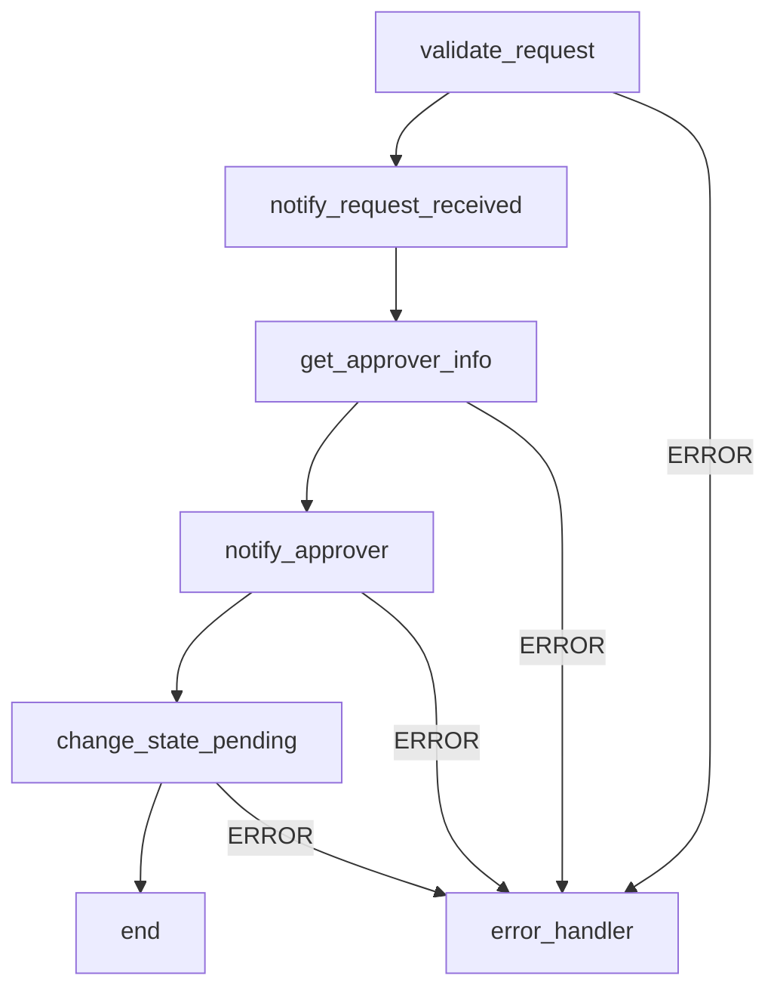
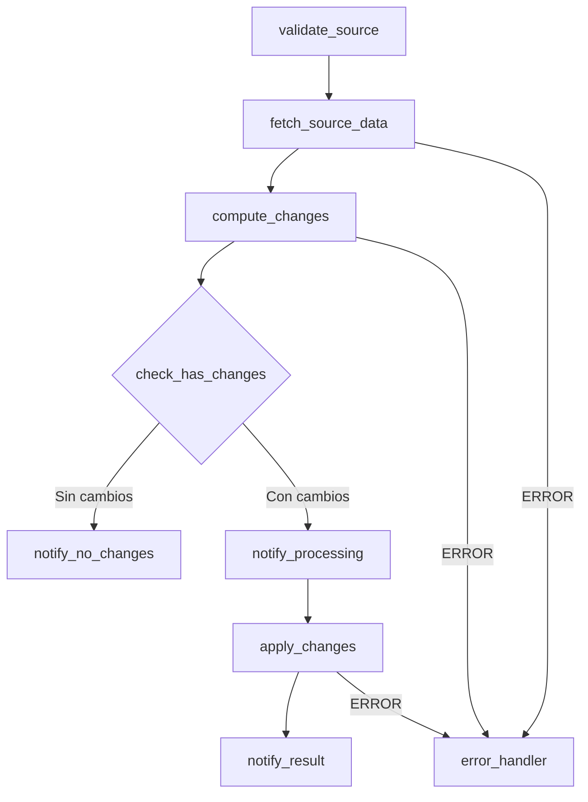
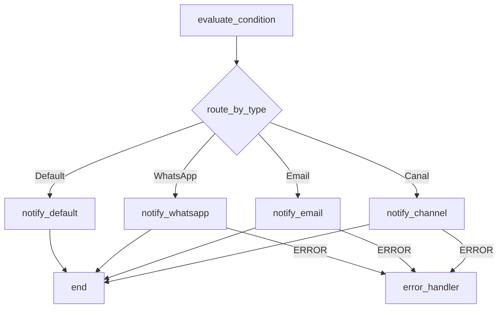
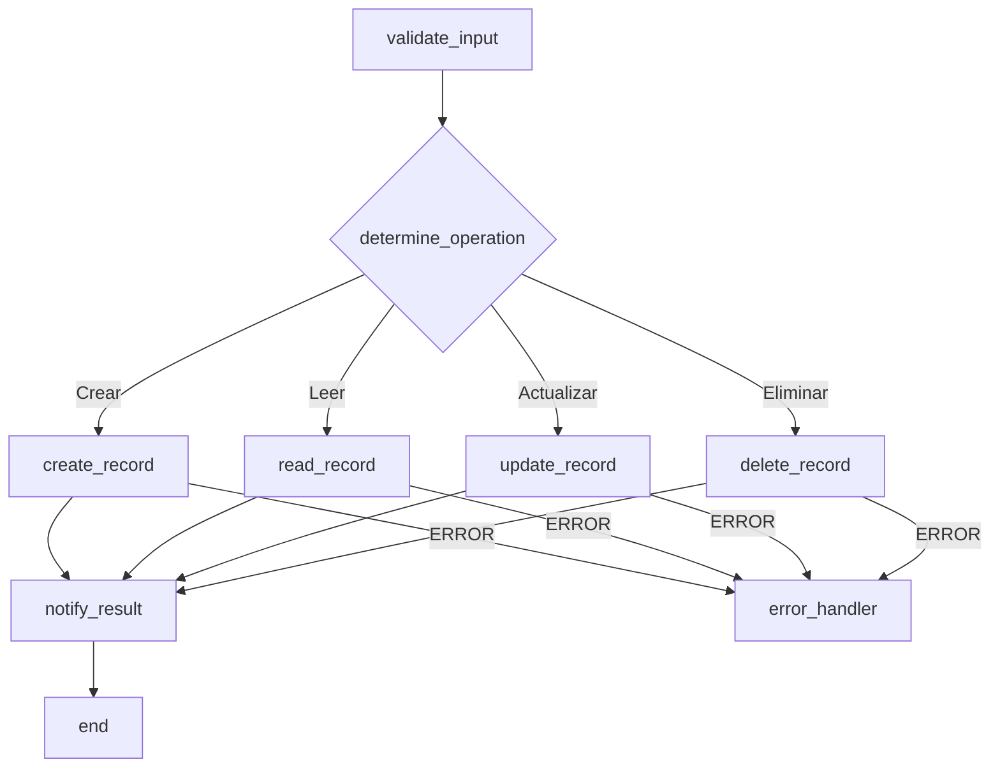
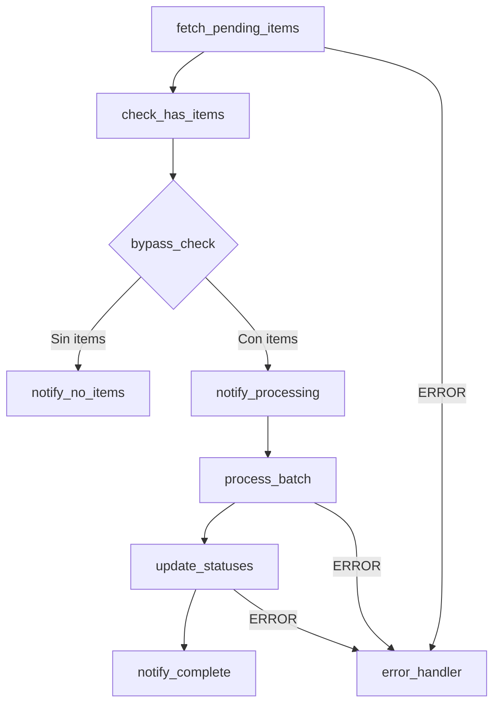

# Guía de Creación de Rutinas desde Requerimientos de Negocio

Este documento es la guía central para cuando un usuario pide **crear una rutina nueva** a partir de una descripción de regla de negocio. Sigue un flujo de dos fases para asegurar que el diseño sea correcto antes de generar el JSON final.

---

## Flujo de Dos Fases

### Fase 1: Diseño (requiere aprobación del usuario)

1. **Recopilar requerimiento**: Entender la regla de negocio en español
2. **Identificar tipo de flujo**: Mapear a uno de los 5 patrones comunes (ver abajo)
3. **Seleccionar template base**: De `templates/routines/`
4. **Generar diseño**:
   - Diagrama Mermaid del flujo de stages
   - Tabla de stages con tipo, propósito, y datos clave
   - Data flow: qué datos entran, cómo se transforman, qué sale
   - Variables/placeholders que el usuario debe configurar
   - Cálculo de `maxIterations`
5. **Presentar al usuario** y **ESPERAR aprobación** antes de continuar

### Fase 2: Generación (solo después de aprobación)

1. **Generar `routine.json`**: Documento MongoDB completo con best practices aplicadas
2. **Generar `setup-guide.md`**: Instrucciones de importación y configuración
3. **Guardar artefactos** en sesión: `requirement.md`, `design.md`, `routine.json`, `setup-guide.md`
4. **Mostrar resumen** con próximos pasos

---

## Matriz de Selección de Stages

Mapeo de necesidad de negocio a tipo de stage:

| Necesidad de Negocio | Stage Type | Notas |
|---|---|---|
| Leer datos de formulario/trigger | `$VALUE` (COTLang) | No necesita stage, se usa en expresiones |
| Leer resultado de stage anterior | `$OUTPUT` (COTLang) | No necesita stage, se usa en expresiones |
| Consultar API interna Cotalker | `NWRequest` (GET) | Usar URLs relativas con `$ENV#BASEURL` |
| Consultar API externa | `NWRequest` (GET) | URL completa, considerar timeout |
| Enviar datos a API | `NWRequest` (POST/PATCH) | Validar body y método |
| Crear tarea | `PBCreateTask` | Requiere taskGroup, workflow |
| Actualizar tarea | `PBUpdateTask` | JSON Patch format |
| Cambiar estado de tarea | `PBChangeState` | Requiere taskId, newState |
| Duplicar tarea | `PBDuplicateTask` | Requiere taskId fuente |
| Crear elemento/propiedad | `PBCreateProperty` | Requiere model, data |
| Actualizar elemento/propiedad | `PBUpdateProperty` | JSON Patch format |
| Lógica condicional (si/sino) | `FCIfElse` | Condición simple true/false |
| Múltiples condiciones (switch) | `FCSwitchOne` | Primera coincidencia gana |
| Múltiples acciones paralelas | `FCSwitchAll` | Ejecuta todas las coincidencias |
| Iterar sobre una lista | `FCEach` | Cuidado con N+1 patterns |
| Esperar un tiempo | `FCSleep` | Milisegundos |
| Ejecutar lógica compleja | `CCJS` | JavaScript, timeout 30s, libs: axios, date-fns |
| Enviar email | `PBEmail` | Soporta HTML en body |
| Enviar mensaje a canal | `PBMessage` | Markdown soportado |
| Enviar WhatsApp | `PBWhatsApp` | Templates pre-aprobados |
| Generar PDF | `PBPdf` | Template HTML → PDF |
| Enviar formulario | `PBSendSurvey` | Solicitar información |
| Crear canal | `PBCreateChannel` | Nuevo espacio de comunicación |
| Crear usuario | `PBCreateUser` | Onboarding automatizado |
| Ejecutar otra rutina | `PBRoutine` | Requiere routine ID |

---

## 5 Patrones de Flujo Comunes

### Patrón 1: Flujo de Aprobación

**Cuándo usar**: Solicitudes que requieren revisión y aprobación/rechazo por un responsable.

**Ejemplos**: Aprobación de compras, solicitudes de vacaciones, aprobación de documentos.

**Template**: `templates/routines/approval-workflow.json`

**Diagrama típico**:


**Stages típicos**: validar_datos → notificar_recepcion → obtener_aprobador → notificar_aprobador → cambiar_estado_pendiente

**Trigger típico**: Survey answer (formulario de solicitud) o Workflow state change

---

### Patrón 2: Sincronización de Datos

**Cuándo usar**: Cuando se necesita sincronizar datos entre sistemas, calcular diferencias y aplicar cambios.

**Ejemplos**: Sync de inventario, actualización de precios, importación de datos.

**Template**: `templates/routines/data-sync.json`

**Diagrama típico**:


**Stages típicos**: validar_fuente → obtener_datos → calcular_delta → bypass_vacio → notificar_inicio → aplicar_cambios → notificar_resultado

**Trigger típico**: Schedule (ejecución programada) o Workflow state change

---

### Patrón 3: Notificaciones Condicionales

**Cuándo usar**: Cuando diferentes condiciones disparan notificaciones por distintos canales o a distintos destinatarios.

**Ejemplos**: Alertas por prioridad, notificaciones multi-canal, escalamiento.

**Template**: `templates/routines/notification-rules.json`

**Diagrama típico**:


**Stages típicos**: evaluar_condicion → switch_por_tipo → [branch_canal / branch_email / branch_whatsapp / branch_default]

**Trigger típico**: Survey answer, Workflow state change, o SLA

---

### Patrón 4: Operaciones CRUD

**Cuándo usar**: Formularios que crean, leen, actualizan o eliminan registros según la acción seleccionada.

**Ejemplos**: ABM de entidades, gestión de registros, formularios multi-acción.

**Template**: `templates/routines/crud-operation.json`

**Diagrama típico**:


**Stages típicos**: validar_entrada → determinar_operacion → [crear / leer / actualizar / eliminar] → notificar_resultado

**Trigger típico**: Survey answer (formulario con selector de acción)

---

### Patrón 5: Tarea Programada (Scheduled/Batch)

**Cuándo usar**: Procesos que se ejecutan periódicamente para procesar lotes de datos pendientes.

**Ejemplos**: Procesamiento de órdenes pendientes, limpieza de datos, reportes diarios.

**Template**: `templates/routines/scheduled-task.json`

**Diagrama típico**:


**Stages típicos**: obtener_pendientes → verificar_hay_items → bypass_vacio → notificar_inicio → procesar_lote → actualizar_estados → notificar_completado

**Trigger típico**: Schedule (cron)

---

## Patrones COTLang Comunes para Creación

### Acceso a datos del formulario/trigger
```
$VALUE#data|[find=>identifier=campo_nombre]|process
$VALUE#data|[find=>identifier=campo_email]|process|0|value
```

### Construcción de URLs de API
```
$JOIN#/#($ENV#BASEURL)#api#v2#properties#($OUTPUT#get_item#data|_id)
```

### Acceso a output de stage anterior
```
$OUTPUT#stage_key#data|campo
$OUTPUT#stage_key#data|nested|field
```

### Concatenación de textos
```
$JOIN# #Solicitud#de#($OUTPUT#get_user#data|name|firstName)
```

### Verificar tamaño de array
```
$OUTPUT#get_items#data|[size=>*]
```

### Filtrar array
```
$OUTPUT#get_items#data|[filter=>status=active]
```

### Timestamp actual
```
$TIME#now#*
```

### Variable de entorno
```
$ENV#BASEURL
$ENV#ERROR_CHANNEL
$ENV#PROGRESS_CHANNEL
```

---

## Convenciones de Nombres

### Stage keys
- Formato: `verbo_sustantivo` en snake_case
- Ejemplos: `validar_datos`, `obtener_propiedades`, `calcular_delta`, `notificar_resultado`
- Para error handlers: `error_handler` (centralizado) o `error_[contexto]` (específico)
- Para bypass: `check_tiene_[entidad]`
- Para notificaciones de progreso: `notify_procesando_[operacion]`

### Verbos comunes
| Verbo | Uso |
|-------|-----|
| `validar_` | Validación de entrada |
| `obtener_` / `fetch_` | Lectura de datos (NWRequest GET) |
| `calcular_` / `compute_` | Transformación de datos (CCJS) |
| `crear_` / `create_` | Creación de entidades |
| `actualizar_` / `update_` | Actualización de datos |
| `eliminar_` / `delete_` | Eliminación (soft delete) |
| `notificar_` / `notify_` | Envío de notificaciones |
| `verificar_` / `check_` | Verificaciones y bypass |
| `procesar_` / `process_` | Procesamiento de lotes |
| `enviar_` / `send_` | Envío de emails/WhatsApp |

---

## Cálculo de maxIterations

La fórmula para calcular `maxIterations` de una rutina:

```
maxIterations = (stages_lineales) + (loops × iteraciones_estimadas × stages_dentro_del_loop) + margen_20%
```

**Ejemplos**:

| Rutina | Cálculo | maxIterations |
|--------|---------|---------------|
| 10 stages sin loops | 10 + 20% = 12 | **15** (redondear a múltiplo de 5) |
| 8 stages + 1 loop (50 items × 2 stages) | 8 + (50×2) + 20% = 130 | **130** |
| 15 stages + 2 loops (100×3 + 20×2) | 15 + 300 + 40 + 20% = 426 | **430** |

**Regla**: Siempre redondear hacia arriba al múltiplo de 5 más cercano.

**Para rutinas sin loops**: Usar `maxIterations = max(stages × 1.5, 20)` como mínimo.

---

## Estructura MongoDB Generada

Cuando se genera la rutina en Fase 2, el documento debe tener esta estructura:

```json
{
  "_comment": "Rutina generada por Cotalker Routine Optimizer. [DESCRIPCION_BREVE]",
  "company": "[COMPANY_ID]",
  "isActive": true,
  "maxIterations": 100,
  "surveyTriggers": [
    {
      "triggers": [
        {
          "version": "v3",
          "start": "primer_stage_key",
          "stages": [
            {
              "key": "stage_key",
              "name": "StageType",
              "_comment": "Descripción del propósito de este stage",
              "data": {},
              "next": {
                "OK": "siguiente_stage",
                "ERROR": "error_handler"
              }
            }
          ]
        }
      ]
    }
  ]
}
```

**Notas importantes**:
- **NO incluir `_id`**: MongoDB lo genera automáticamente al importar
- **Incluir `_comment`**: En cada stage para documentación inline
- **Incluir `company`**: Como placeholder `[COMPANY_ID]` para que el usuario lo reemplace
- **Usar placeholders**: Para IDs y valores específicos del ambiente: `[PLACEHOLDER_NAME]`
- **`version: "v3"`**: Siempre usar versión 3 de triggers

---

## Checklist Pre-Generación (Fase 2)

Antes de generar el JSON final, verificar:

### Estructura
- [ ] Todos los stages tienen `key` único
- [ ] `start` apunta al primer stage existente
- [ ] Todos los `next.OK` y `next.ERROR` apuntan a stages que existen
- [ ] No hay stages huérfanos (sin referencia desde otro stage)
- [ ] `maxIterations` calculado correctamente

### Best Practices (se aplican automáticamente)
- [ ] Error handler centralizado presente (`error_handler` stage)
- [ ] Todos los stages críticos (NWRequest, CCJS, PBCreateTask, PBUpdateTask, PBChangeState, PBDuplicateTask) tienen `next.ERROR`
- [ ] Validación de entrada como primer stage
- [ ] Bypass switch antes de loops que pueden recibir arrays vacíos
- [ ] Notificación de progreso antes de operaciones largas (>5s estimado)

### COTLang
- [ ] Sintaxis correcta: `=>` en funciones (no `=`)
- [ ] `$OUTPUT` referencia stages que realmente existen
- [ ] `$ENV` para URLs base y canales de notificación
- [ ] Variables tipadas correctamente (cast cuando se usa, no al declarar)

### Documentación
- [ ] `_comment` en cada stage
- [ ] Placeholders documentados en `setup-guide.md`
- [ ] Stage keys descriptivos (verbo_sustantivo)

---

## Artefactos de Sesión

Al completar una creación de rutina, guardar en `.sessions/TIMESTAMP/`:

| Archivo | Fase | Contenido |
|---------|------|-----------|
| `requirement.md` | 1 | Requerimiento original del usuario (en español) |
| `design.md` | 1 | Diagrama Mermaid + tabla de stages + data flow + variables |
| `routine.json` | 2 | Documento MongoDB completo listo para importar |
| `setup-guide.md` | 2 | Instrucciones de importación, placeholders a reemplazar, verificación |
| `README.md` | 2 | Metadata de la sesión (creado por session manager) |

### Contenido de `design.md`

```markdown
# Diseño de Rutina: [NOMBRE]

## Requerimiento
[Resumen del requerimiento de negocio]

## Tipo de Flujo
[Patrón seleccionado] (basado en `templates/routines/[template].json`)

## Diagrama de Flujo
```mermaid
graph TD
    [diagrama]
```

## Stages
| # | Key | Tipo | Propósito | Datos Clave |
|---|-----|------|-----------|-------------|
| 1 | validar_datos | FCSwitchOne | Validar entrada | control: $VALUE#data |
| 2 | ... | ... | ... | ... |

## Data Flow
1. **Entrada**: [Qué datos llegan del trigger]
2. **Transformaciones**: [Cómo se procesan]
3. **Salida**: [Qué datos se generan/modifican]

## Variables a Configurar
| Placeholder | Descripción | Ejemplo |
|-------------|-------------|---------|
| [COMPANY_ID] | ID de la empresa | 507f1f77bcf86cd799439011 |
| [ERROR_CHANNEL] | Canal de errores | ObjectId del canal |
| ... | ... | ... |

## maxIterations
[Cálculo detallado]
```

### Contenido de `setup-guide.md`

```markdown
# Guía de Configuración: [NOMBRE]

## 1. Preparación
- [ ] Tener acceso de admin a Cotalker
- [ ] Identificar los IDs de tu ambiente

## 2. Reemplazar Placeholders
| Placeholder | Dónde encontrar el valor |
|-------------|------------------------|
| [COMPANY_ID] | Admin > Settings > Company ID |
| [TASK_GROUP_ID] | Admin > Workflow > Task Group |
| ... | ... |

## 3. Importar Rutina
1. Conectarse a MongoDB
2. Insertar documento en colección `routines`
3. Verificar que `isActive: true`

## 4. Configurar Trigger
- **Survey trigger**: Asociar al formulario correspondiente
- **Workflow trigger**: Asociar al cambio de estado
- **Schedule trigger**: Configurar cron expression

## 5. Verificación
- [ ] Ejecutar rutina con datos de prueba
- [ ] Verificar que notificaciones llegan
- [ ] Verificar que error handler funciona (provocar error controlado)
- [ ] Verificar que datos se crean/actualizan correctamente
```

---

## Selección de Template por Tipo de Requerimiento

| Palabras clave en el requerimiento | Template sugerido |
|---|---|
| "aprobar", "aprobación", "rechazar", "autorizar", "solicitud" | `approval-workflow.json` |
| "sincronizar", "sync", "importar", "exportar", "migrar", "actualizar datos" | `data-sync.json` |
| "notificar", "alertar", "avisar", "enviar mensaje", "escalar" | `notification-rules.json` |
| "crear", "editar", "eliminar", "formulario", "ABM", "CRUD" | `crud-operation.json` |
| "programado", "diario", "semanal", "cada X", "pendientes", "batch", "lote" | `scheduled-task.json` |

Si el requerimiento no encaja claramente en ninguno, usar el más cercano como base y adaptarlo.

---

## Best Practices Auto-Aplicadas

Al crear rutinas nuevas, se aplican automáticamente estas best practices (ver `knowledge/best-practices.md`):

1. **Error handler centralizado**: Siempre incluir un stage `error_handler` con `PBMessage` a `$ENV#ERROR_CHANNEL`
2. **`next.ERROR` en stages críticos**: NWRequest, CCJS, PBCreateTask, PBUpdateTask, PBChangeState, PBDuplicateTask
3. **Validación de entrada**: Primer stage valida datos requeridos del trigger
4. **Bypass para loops**: FCSwitchOne antes de FCEach para saltar si array está vacío
5. **Notificaciones de progreso**: PBMessage antes de operaciones que toman >5 segundos
6. **Nombres descriptivos**: Stage keys en formato `verbo_sustantivo` snake_case
7. **Comentarios inline**: `_comment` en cada stage explicando su propósito

---

## Ejemplo Completo: De Requerimiento a Rutina

### Requerimiento del usuario
> "Necesito una rutina que cuando un empleado llena el formulario de solicitud de vacaciones, notifique a su jefe directo por mensaje en Cotalker y cambie el estado de la tarea a 'Pendiente aprobación'."

### Paso 1: Identificar
- **Tipo**: Flujo de aprobación
- **Template**: `approval-workflow.json`
- **Trigger**: Survey answer (formulario de vacaciones)
- **Entidades**: Empleado (user), Jefe (approver), Tarea (task)
- **Canales**: Canal de la tarea, canal de errores

### Paso 2: Diseñar (Fase 1)
- Diagrama Mermaid con stages
- Tabla con 6 stages: validar → notificar_recepcion → obtener_jefe → notificar_jefe → cambiar_estado → error_handler
- Data flow: formulario → datos de solicitud → notificación → cambio de estado

### Paso 3: Generar (Fase 2, tras aprobación)
- JSON completo con best practices
- Setup guide con placeholders

---

## Referencias

- `knowledge/cotalker-routines.md` - Tipos de stages y capacidades completas
- `knowledge/cotlang-reference.md` - Referencia completa de COTLang
- `knowledge/best-practices.md` - Mejores prácticas detalladas
- `knowledge/cotalker-api-reference.md` - Referencia de API para NWRequest
- `knowledge/anti-patterns.json` - Anti-patterns a evitar al crear
- `knowledge/optimization-patterns.md` - Patrones de optimización
- `templates/routines/` - Templates base para cada tipo de flujo
- `templates/stages/error-handler.json` - Template de error handler
- `templates/stages/progress-notification.json` - Template de notificación de progreso
